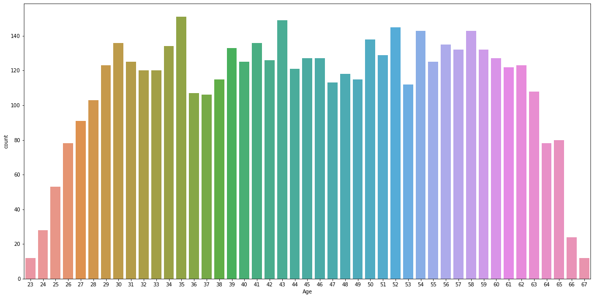
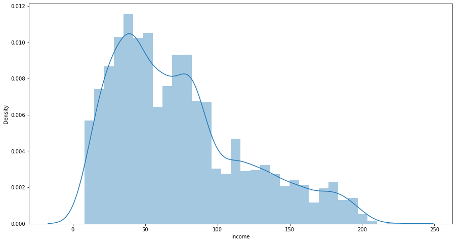
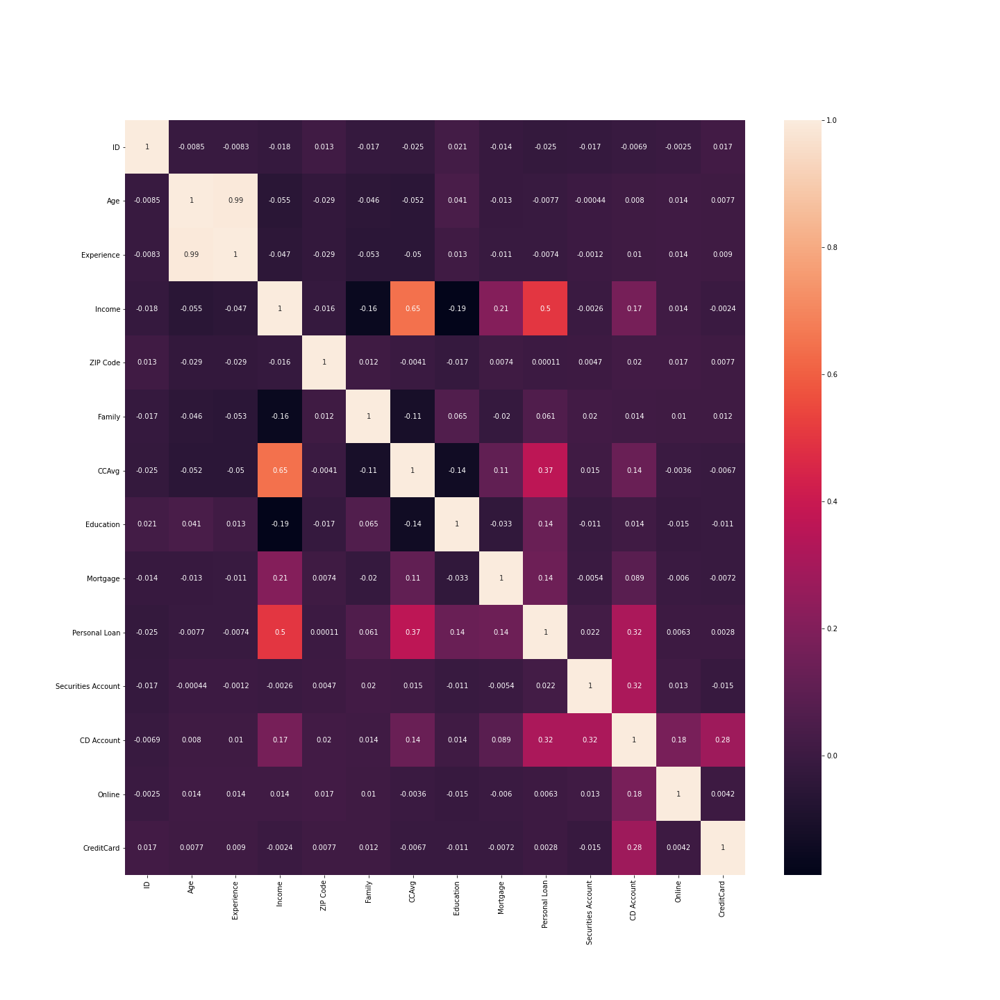
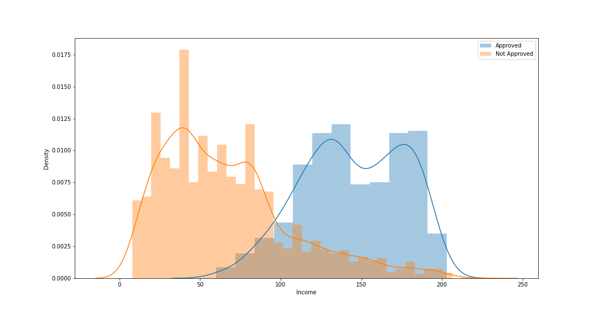
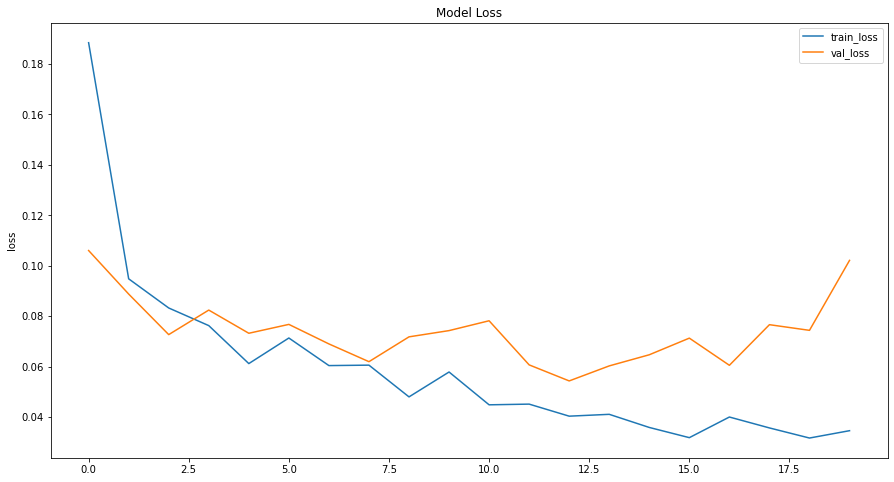
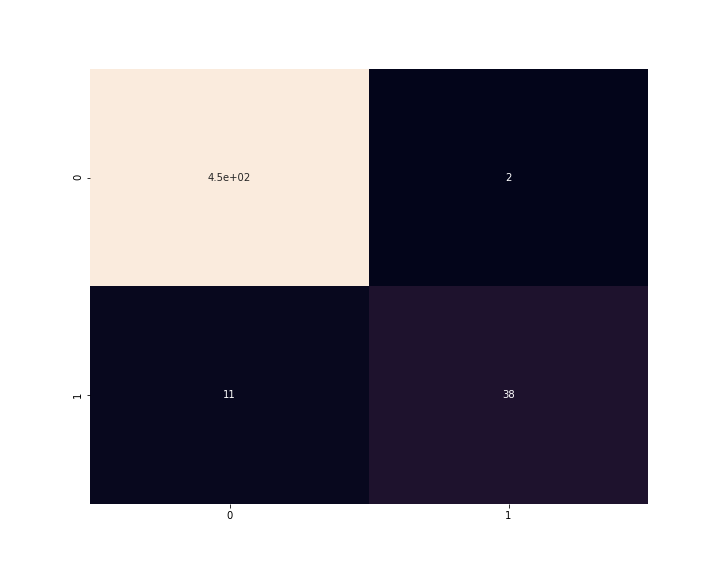

# Bank-Loan-Prediction-using-ANN
 A multi-layer neural network model for predicting approval for personal bank loans.

#### -- Project Status: [Completed]

## Project Intro/Objective
The purpose of this project is design a machine learning algorithm using Artificial Neural Network that would predict the likelihood of a customer getting approved for a bank loan.

### Methods Used
* Data Visualization
* Exploratory Data Analysis
* Machine Learning
* etc.

### Technologies
* Python, Markdown
* Tensorflow, Keras
* Pandas, numpy, matplotlib, seaborn
* Jupyter
* etc. 

## Project Description
The dataset for this project consists of labeled data with following features. The target column is called 'Personal Loan' which is used to predict whether a customer gets approved for loan or not.

* ID: Customer ID
* Age: Customer Age
* Experience: Amount of work experience in years
* Income: Amount of annual income (in thousands)
* Zipcode: Zipcode of where customer lives
* Family: Number of family members
* CCAvg: Average monthly credit card spendings
* Education: Education level (1: Bachelor, 2: Master, 3: Advanced Degree)
* Mortgage: Mortgage of house (in thousands)
* Securities Account: Boolean of whether customer has a securities account
* CD Account: Boolean of whether customer has Certificate of Deposit account
* Online: Boolean of whether customer uses online banking
* CreditCard: Does the customer use credit card issued by the bank?
* Personal Loan: This is the target variable (Binary Classification Problem)

As it can be seen, the data consists of various important features in making the decision for loan approval. This project is more of an introduction to building a neural network model for predictive modeling. We will be using Tensorflow and Keras via Python for achieving these tasks.

## Exploratory Data Analysis/Visualization
- Firstly, let's see some interesting trends and visualizations in our dataset:

- We can also check the correlation between our various features. We can see how experience and age have high correlation. As people grow older, they gain more work experience.

- Let's also check the distribution of 2 income groups. One with people who got loan approval versus the second group that didn't get approved.

## Data Preparation
1. To start off, we will first convert our binary target column 'Personal Loan' to categorical. This will represent two categories: Approved and Not Approved.
2. Next, we will randomly split our dataset into 2 parts: 90% for training and 10% for testing. Moreover, the training data is also later on split into 2 parts where 20% of it is used for cross-validation.
3. Lastly, we wil standardize all our features so that the neural network can process them properly and assign the correct weigtage.

## Building the Multi-Layer Neural Network
1. At this point, we will start by assigning all the features as input. Next we add some hidden layers to the model and then finish it off with the final target variable.
2. There are a total of 755,752 trainable parameters once the NN is set up

## Implementation and Results (Metrics)
1. We now fit our model to our training data. Below is a plot showing the Model Loss vs. Epoch plot for this model.

2. After training and cross validation, we use our model on the testing set to predict the outcome. One more thing to note is that the model is trained for the 'f1' metrics as the dataset is highly unbalanced. It would be unwise to use accuracy metrics.
3. Below is the confusion matrix obtained from the final model.

## Featured Notebooks/Analysis
* [Notebook](bank-loan-approval-using-AI.ipynb)
* [Dataset](UniversalBank.csv)

